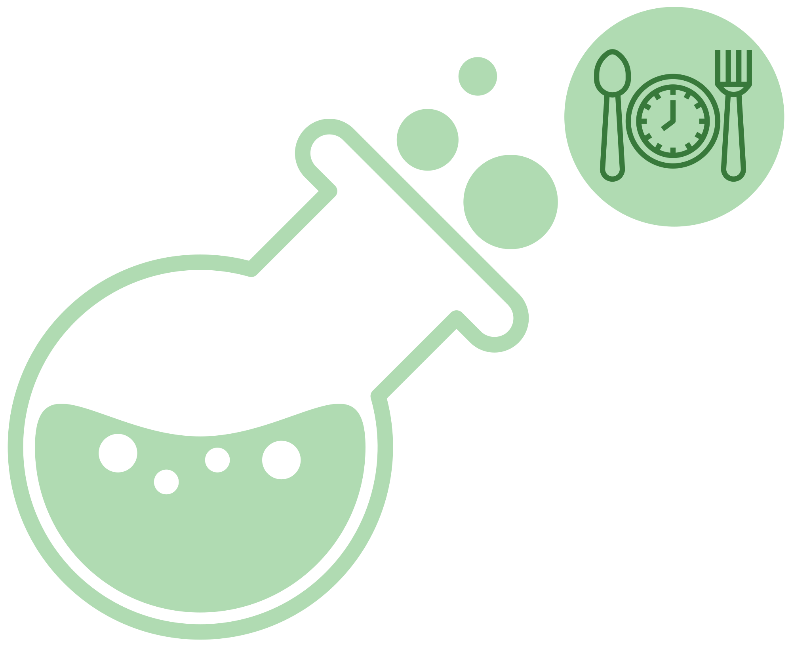

# mealchemy

<!--toc:start-->
- [mealchemy](#mealchemy)
  - [Overview](#overview)
  - [Requirements](#requirements)
    - [Cloud](#cloud)
    - [Docker](#docker)
    - [Local](#local)
  - [Running Options](#running-options)
    - [1. Cloud Deployment](#1-cloud-deployment)
    - [2. Docker Deployment](#2-docker-deployment)
    - [3. Local Development](#3-local-development)
      - [Backend (Django)](#backend-django)
      - [Frontend (React)](#frontend-react)
      - [Recipe Extractor (Custom Python Service)](#recipe-extractor-cust  om-python-service)
  - [Environment Variables](#environment-variables)
    - [CloudAMQP URL](#cloudamqp-url)
    - [USDA FDC API Key](#usda-fdc-api-key)
    - [OpenAI API Key](#openai-api-key)
    - [Docker configuration](#docker-configuration)
    - [Local run](#local-run)
<!--toc:end-->

<div align="center">


</div>

Smart meal planning & shopping app for ECE 493 W2025, group 6.

## Overview

This is a micro-service application that consists of the following components:

- **Backend**: A Django-based API service.
- **Frontend**: A React-based frontend application.
- **Recipe Extractor**: A custom Python service for scraping and processing recipe data.
- **Database**: Database for sotring user information

The application can be used/ran in different environments using the following methods:

- **Google Cloud Platform**
- **Docker** 
- **Local Development** (Very Manual setup)

---

## Requirements

### Cloud 

- None!

### Docker 
Installation of docker can be found here:  https://docs.docker.com/engine/install/
#### Operating System:
- WSL2
- Linux

####


### Local 

#### Dependencies
- Python 3.12
- Tesseract-OCR
  - Ubuntu: `sudo apt install -y tesseract-ocr`
- poppler-utils
  - Ubuntu: `sudo apt install -y poppler-utils`
- Node.js and npm
  - Install node in any way that you want [here](https://nodejs.org/en/download/). In this case, get v22.14.0 (LTS) under Linux.
- Chrome
  - Ubuntu:
    - `wget https://dl.google.com/linux/direct/google-chrome-stable_current_amd64.deb`
    - `sudo dpkg -i google-chrome-stable_current_amd64.deb; apt-get -fy install`

#### Virtual Environment
Create a Python virtual environment
```
python -m venv .mealchemyEnv
```

Start environemnt
```
source .mealchemyEnv/bin/activate
```

## Running Options

### 1. Cloud Deployment

To see the fully deployed application visit [mealchemy.app](https://www.mealchemy.app)

   
### 2. Docker Deployment

To run the application using Docker, follow these steps:

1. **Ensure Docker is installed**:
   - Make sure Docker and Docker Compose are installed on your machine. [Install Docker](https://www.docker.com/get-started).

2. **Build and run the containers**:
   - Navigate to the project directory where the `docker-compose.yml` file is located.
   - Run the following command to build and start the services:
     ```bash
     docker-compose up --build
     ```

3. **Initialize the database**:
   - In another terminal, navigate to the root of the repository, and type the following:
     ```bash
     docker-compose exec backend bash
     ```

     ```bash
     python manage.py migrate
     ```

   - Alternatively, from Docker Desktop, you can directly access the `backend` container's shell by clicking on 'Containers' -> 'backend' -> 'Exec', and type the following:

     ```bash
     python manage.py migrate
     ```

3. **Access the application**:
   - **Backend**: The Django backend will be available at `http://localhost:8000`.
   - **Frontend**: The React frontend will be available at `http://localhost:3000`.
   - **Recipe Extractor**: The extractor service will run in the background and listen for tasks from the backend.

4. **Stopping the services**:
   - To stop the services, run:
     ```bash
     docker-compose down
     ```

### 3. Local Development

If you prefer to run the application locally, follow these steps to set up each component:

#### Backend (Django)

1. **Install dependencies**:
   - Navigate to the `backend` directory and install the necessary dependencies using `pip`:
     ```bash
     cd backend
     pip install -r requirements.txt
     ```

2. **Apply migrations**:
   - Run Django migrations to set up the database:
     ```
     python manage.py makemigrations && python manage.py migrate
     ```

3. **Run the backend**:
   - Start the Django development server:
     ```bash
     python manage.py runserver
     ```

   - The backend will be available at `http://localhost:8000`.

#### Frontend (React)

1. **Install dependencies**:
   - Navigate to the `frontend` directory and install the necessary dependencies using `npm` or `yarn`:
     ```bash
     cd frontend
     npm install
     ```

2. **Run the frontend**:
   - Start the React development server:
     ```bash
     npm start
     ```

   - The frontend will be available at `http://localhost:3000`.

##### Frontend Tests
1. Install playwright
   - in the frontend directory run:
      ```bash
     npm install playwright
     npx playwright install chromium
     ```
2. Clear the backend database
   - go to the backend directory and run:
     ```bash
     python manage.py shell < backend/cleanup.py
     ```
3. Execute tests one by one by executing the following commands after the previous one has finished:
    ```bash
    npx playwright test tests/specs/login.spec.ts
    npx playwright test tests/specs/recipe.spec.ts
    npx playwright test tests/specs/meal-planning.spec.ts
    npx playwright test tests/specs/shopping-list.spec.ts
    ```
     
#### Recipe Extractor (Custom Python Service)

1. **Install dependencies**:
   - Navigate to the `recipe-extractors` directory and install the required Python packages:
     ```bash
     cd recipe-extractors
     pip install -r requirements.txt
     ```

2. **Run the extractor**:
   - The recipe extractor is designed to run as a background service and listen for tasks from the backend.
   - Start the extractor service:
     ```bash
     python consumer.py
     ```

---

## Environment Variables

If you're using Docker or local development, you might need to set up environment variables. These should be placed in a `.env` file in the root of your project.

### Docker configuration

If you would like to run the project locally under a Docker container, create a `.env` file at the root of this repository:

- Make sure that `DOCKER=True` under 'Docker settings' below.

```env
## Global
OPENAI_ECE493_G06_KEY="my_openai_key"
USDA_FDC_API_KEY="my_fdc_api_key"
PIKA_URL="my_cloudamqp_url"
SECRET_KEY="my_django_secretkey"

# Email (for sending forgot password emails)
EMAIL_PASSWORD="my_email_password"
EMAIL_USER="my_email_user"
DEFAULT_EMAIL="my_default_email"

## Docker settings
DOCKER="True"
POSTGRES_DB="db"
POSTGRES_USER="my_postgres_user"
POSTGRES_PASSWORD="my_postgres_password"
EXTRACT_URL="http://backend:8080"
DATABASE_URL="postgres://postgres:root@db:5432/db" # you can directly use this as its defined in the docker container
```

### Local run

If you are running locally, you need to have your postgres installation and point the url to your database and user credentials. If this is too difficult you can also directly use a sqlite3 instance with the. Simply unset the databse url environment variable using `unset DATABASE_URL` and comment it out in your .env. This will use a sqlite3 instance instead.

make sure to set `DOCKER="False"` like in the example below:

```env
## Global
OPENAI_ECE493_G06_KEY="my_openai_key"
USDA_FDC_API_KEY="my_fdc_api_key"
PIKA_URL="my_cloudamqp_url"
SECRET_KEY="my_django_secretkey"

# Email (for sending forgot password emails)
EMAIL_PASSWORD="my_email_password"
EMAIL_USER="my_email_user"
DEFAULT_EMAIL="my_default_email"

## Local settings
DOCKER="False"
DATABASE_URL="postgresql://<user>:<password>@localhost:5432/<database_name>"

# Or if you want to just use sqlite
DOCKER="False"
USE_SQLITE3="True" # Use if you want make debugging a bit easier locally, as there are VSCode extensions that let you view SQLite3 databases.
POSTGRES_DB="db"
POSTGRES_USER="my_postgres_user"
POSTGRES_PASSWORD="my_postgres_password"
DATABASE_URL="my_postgres_url"
```

Similarly to with Docker, create two `.env` files in the `backend/` and `recipe-extractors/` directories.

## User Guide
### Login Page
#### Sign up
- Click on the Sign up button and enter email and password in the corresponding textfields
- Password must be between 6 and 50 characters with 1 special character
  
#### Login
- Enter in credentials and access the site

#### Forgot Password
- User must enter the registered email in order to send a password
- If there is a match, an email will be sent containing a link to change the password

### Recipe Page
#### Recipe Panel
<div>
</div>

- **Recipe Addition Methods:**
  - Add manually (all fields, including tags, must be filled)
  - Add by URL (warns user if any fields are missing)
  - Add by PDF (warns user if any fields are missing)

- **Select Option Features:**
  - Select and delete recipes
  - Select and add recipes to Shopping List
  - View recipe content when a recipe is selected
    
<div></div>

- Recipes are easily searchable through these filters

#### Recipe COntent
<div>

  </div>
  
- **Recipe Management:**
  - Edit and Delete buttons allow the user to edit and delete recipes
  - Tags can be removed and must be replaced with a new tag

- **Ingredient Handling:**
  - When manually adding ingredients, if the ingredient is not in the database, the user is required to specify the grocery aisle
  - If a recipe is added through URL or PDF, the grocery aisle is inferred using an LLM and added to the database

### Meal Planning Page
<div>

  </div>
  
- **Meal Plan Creation:**
  - The user can add a meal slot by selecting the dropdown corresponding to the desired day
  - The user can then drag and drop a recipe into the placeholder meal slot
  - Meal slots can be deleted by clicking on the garbage icon
  - The meal plan will only be saved if it is not blank and all placeholder meal slots are filled

- **Additional Features:**
  - Recipes can be added to the shopping list as long as they are within the current calendar view
  - Nutrition for the saved meal plan is visible by clicking on the Nutrition Details tab


### Shopping List Page
<div>

  </div>
  
- The ingredients can be crossed out by checking the boxes, this will reset when the page is refreshed
- If the aisle is incorrect for the ingredient, the ingredient can be moved and entering the correct aisle in the modal
- The recipe can also be removed from the Shopping List by clicking on the checkbox in the Recipes box. This will also remove the ingredients in the Shopping List

### User Profile
#### Change Password
- Click on the Change Password button, enter the new password, and click on Done 
- The password must fulfill the same conditions as the Sign Up page
  
#### Sign out
- Click on the button to Sign Out and be redirected to the Login page


